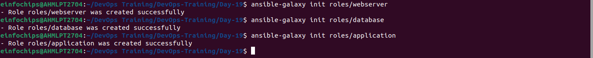

# Project Overview

### Milestone 1: Environment Setup
#### Objective: Configure your development environment and AWS infrastructure.
#### Tasks: Launch an AWS EC2 instance running Ubuntu. Install Ansible and Git on your local machine or control node.

- Install Ansible
```
sudo apt update
sudo apt install ansible
```
- Install Git
```
sudo apt install git
```

- Launch EC2 instance
```
ssh -i ansible-new.pem ubuntu@54.XX1.74.226
```

### Milestone 2: Create Ansible Role Structure
#### Objective: Organize your Ansible project using best practices for playbooks and roles

```
ansible-galaxy init webserver
ansible-galaxy init database
ansible-galaxy init application
```


### Milestone 3: Version Control with Git
#### Objective: Implement version control for your Ansible project.

```
git init

echo "*.retry" >> .gitignore
echo "*.log" >> .gitignore
```
